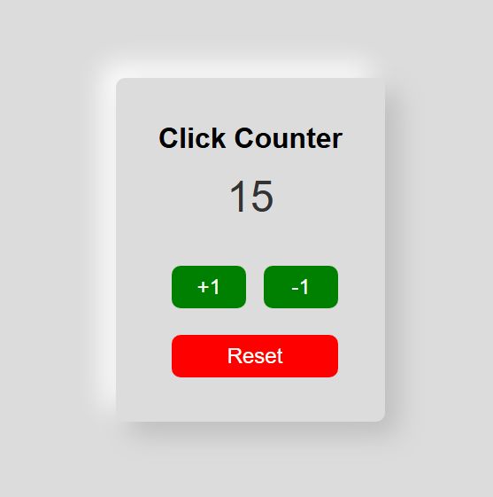

# Мой кликер

Это простая программа-счётчик.  
Я сделала её на HTML, CSS и JavaScript.

## Что умеет
- Кнопка **+1** — прибавляет 1 к числу.
- Кнопка **-1** — вычитает 1 (не уходит в минус).
- Кнопка **Reset** — сбрасывает счётчик на 0.
- Помнит число даже после перезагрузки страницы.

## Как открыть
1. Открыть файл `index.html` в браузере.
2. Нажимать кнопки и смотреть, как меняется число.

## Скриншот

